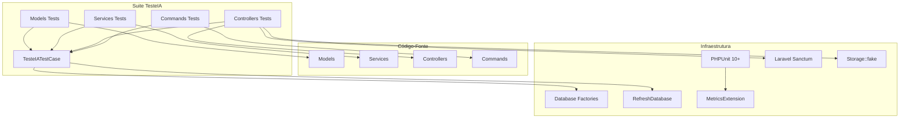
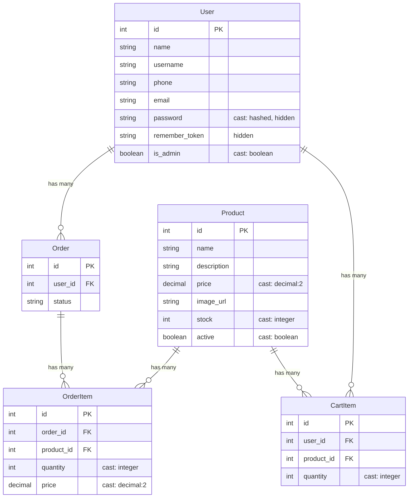

# Documento de Design — Suite de Testes Unitários IA (TesteIA)

## Visão Geral

Este documento descreve o design técnico para a criação da suite de testes `TesteIA`, uma segunda suite de testes unitários no backend PHP/Laravel que representa testes gerados por IA. A suite será armazenada em `tests/TesteIA/` e cobrirá Models, Services, Controllers e Commands, com meta de 100% de cobertura de código. Os resultados serão comparados com a suite existente `JuniorPlenoTests`.

A suite seguirá a mesma arquitetura da `JuniorPlenoTests` — uma classe base abstrata (`TesteIATestCase`) com helpers comuns, e subpastas espelhando a estrutura do código-fonte. A diferença está na profundidade e qualidade dos testes: cobertura completa de branches, edge cases, e validação rigorosa de todos os cenários.

## Arquitetura

### Estrutura de Diretórios

```
tests/
├── TestCase.php                          # Base do Laravel
├── JuniorPlenoTests/                     # Suite existente (comparação)
│   ├── JuniorPlenoTestCase.php
│   ├── Controllers/
│   ├── Models/
│   └── Services/
└── TesteIA/                              # Nova suite
    ├── TesteIATestCase.php               # Classe base abstrata
    ├── Models/
    │   ├── UserModelTest.php
    │   ├── ProductModelTest.php
    │   ├── OrderModelTest.php
    │   ├── OrderItemModelTest.php
    │   └── CartItemModelTest.php
    ├── Services/
    │   ├── AuthServiceTest.php
    │   ├── CartServiceTest.php
    │   ├── OrderServiceTest.php
    │   └── ProductServiceTest.php
    ├── Controllers/
    │   ├── AuthControllerTest.php
    │   ├── CartControllerTest.php
    │   ├── OrderControllerTest.php
    │   ├── ProductControllerTest.php
    │   └── UserControllerTest.php
    └── Commands/
        └── TestMetricsCommandTest.php
```

### Diagrama de Dependências



### Decisões de Design

1. **Espelhamento da JuniorPlenoTests**: A `TesteIATestCase` segue o mesmo padrão da `JuniorPlenoTestCase` (estende `Tests\TestCase`, usa `RefreshDatabase`, fornece helpers `createAdminUser` e `createRegularUser`) para garantir comparabilidade direta.

2. **Isolamento via RefreshDatabase**: Cada teste roda com banco SQLite em memória resetado, garantindo isolamento total entre testes.

3. **Factories do Laravel**: Toda criação de dados de teste usa as factories existentes (`UserFactory`, `ProductFactory`, `OrderFactory`, `OrderItemFactory`, `CartItemFactory`), evitando duplicação.

4. **Storage::fake para uploads**: Testes de `ProductController` que envolvem upload de imagem usam `Storage::fake('public')` para isolar o filesystem.

5. **Sanctum para autenticação**: Testes de endpoints protegidos usam `actingAs($user, 'sanctum')` para simular autenticação.

6. **Cobertura de Commands**: Diferente da `JuniorPlenoTests`, a `TesteIA` inclui testes para `TestMetricsCommand`, cobrindo a pasta `Commands/`.

## Componentes e Interfaces

### TesteIATestCase (Classe Base)

```php
namespace Tests\TesteIA;

abstract class TesteIATestCase extends \Tests\TestCase
{
    use \Illuminate\Foundation\Testing\RefreshDatabase;

    protected function createAdminUser(array $overrides = []): \App\Models\User;
    protected function createRegularUser(array $overrides = []): \App\Models\User;
}
```

Idêntica à `JuniorPlenoTestCase` em funcionalidade, garantindo que ambas as suites operam sob as mesmas condições.

### Organização dos Testes por Camada

| Camada      | Classe Testada       | Arquivo de Teste                        | Foco                                                                |
| ----------- | -------------------- | --------------------------------------- | ------------------------------------------------------------------- |
| Models      | `User`               | `Models/UserModelTest.php`              | Relacionamentos, fillable, hidden, casts                            |
| Models      | `Product`            | `Models/ProductModelTest.php`           | Relacionamentos, fillable, casts, scope, accessors, `decreaseStock` |
| Models      | `Order`              | `Models/OrderModelTest.php`             | Relacionamentos, fillable, accessor `total`                         |
| Models      | `OrderItem`          | `Models/OrderItemModelTest.php`         | Relacionamentos, fillable, casts                                    |
| Models      | `CartItem`           | `Models/CartItemModelTest.php`          | Relacionamentos, fillable, casts                                    |
| Services    | `AuthService`        | `Services/AuthServiceTest.php`          | Login (sucesso/falha), criação de conta, hash de senha              |
| Services    | `CartService`        | `Services/CartServiceTest.php`          | Estoque disponível, CRUD de itens, validações, concorrência         |
| Services    | `OrderService`       | `Services/OrderServiceTest.php`         | Criação de pedido, listagem, atualização de status                  |
| Services    | `ProductService`     | `Services/ProductServiceTest.php`       | CRUD, autorização admin                                             |
| Controllers | `AuthController`     | `Controllers/AuthControllerTest.php`    | Endpoints login, logout, create-account                             |
| Controllers | `CartController`     | `Controllers/CartControllerTest.php`    | Endpoints CRUD carrinho                                             |
| Controllers | `OrderController`    | `Controllers/OrderControllerTest.php`   | Endpoints pedidos e admin                                           |
| Controllers | `ProductController`  | `Controllers/ProductControllerTest.php` | Endpoints CRUD produtos, upload imagem                              |
| Controllers | `UserController`     | `Controllers/UserControllerTest.php`    | Endpoints perfil                                                    |
| Commands    | `TestMetricsCommand` | `Commands/TestMetricsCommandTest.php`   | Execução do comando, opções, integração métricas                    |

### Padrão de Teste

Todos os testes seguem o padrão Arrange-Act-Assert:

```php
public function test_action_scenario_expectedResult(): void
{
    // Arrange - preparação dos dados
    $user = $this->createRegularUser();
    $product = Product::factory()->create(['stock' => 10, 'active' => true]);

    // Act - execução da ação
    $result = $cartService->addItem($user, $product->id, 3);

    // Assert - verificação do resultado
    $this->assertEquals(3, $result->quantity);
    $this->assertDatabaseHas('cart_items', ['user_id' => $user->id]);
}
```

### Integração com PHPUnit

A suite será registrada no `phpunit.xml`:

```xml
<testsuite name="TesteIA">
    <directory>tests/TesteIA</directory>
</testsuite>
```

Executável via: `php artisan test --testsuite=TesteIA` ou `vendor/bin/phpunit --testsuite=TesteIA`.

Compatível com o comando de métricas: `php artisan test:metrics --testsuite=TesteIA`.

## Modelos de Dados

A suite TesteIA não introduz novos modelos de dados. Ela testa os modelos existentes do backend:

### Models Existentes



### Accessors e Computed Properties

| Model     | Accessor            | Lógica                              |
| --------- | ------------------- | ----------------------------------- |
| `Product` | `reserved_quantity` | `cartItems()->sum('quantity')`      |
| `Product` | `available_stock`   | `max(0, stock - reserved_quantity)` |
| `Order`   | `total`             | `items->sum(price * quantity)`      |

### Factories Utilizadas

Todas as factories existentes em `database/factories/` serão reutilizadas:

- `UserFactory` — gera usuários com `is_admin = false` por padrão
- `ProductFactory` — gera produtos ativos com estoque aleatório
- `OrderFactory` — gera pedidos com status `pending`
- `OrderItemFactory` — gera itens de pedido
- `CartItemFactory` — gera itens de carrinho

## Propriedades de Corretude

_Uma propriedade é uma característica ou comportamento que deve ser verdadeiro em todas as execuções válidas de um sistema — essencialmente, uma declaração formal sobre o que o sistema deve fazer. Propriedades servem como ponte entre especificações legíveis por humanos e garantias de corretude verificáveis por máquina._

### Propriedade 1: Relacionamentos de Models retornam registros corretos

_Para qualquer_ Model e qualquer relacionamento definido (User→orders, User→cartItems, Product→cartItems, Product→orderItems, Order→user, Order→items, OrderItem→order, OrderItem→product, CartItem→user, CartItem→product), criar registros relacionados e consultar o relacionamento deve retornar exatamente os registros associados.

**Valida: Requisitos 2.1**

### Propriedade 2: Configuração de atributos dos Models é consistente

_Para qualquer_ Model, os atributos `fillable` devem permitir mass assignment dos campos definidos, os `casts` devem converter valores para os tipos corretos ao recuperar do banco, e os atributos `hidden` não devem aparecer na serialização JSON/array.

**Valida: Requisitos 2.2, 2.3, 2.9**

### Propriedade 3: Scope active filtra apenas produtos ativos

_Para qualquer_ conjunto de produtos com status `active` misto (true/false), o scope `Product::scopeActive` deve retornar exclusivamente os produtos com `active = true`.

**Valida: Requisitos 2.4, 6.1**

### Propriedade 4: Estoque disponível é calculado corretamente

_Para qualquer_ produto com estoque S e qualquer conjunto de CartItems com quantidades Q1, Q2, ..., Qn, o accessor `reserved_quantity` deve ser igual a Q1+Q2+...+Qn, e `available_stock` deve ser igual a `max(0, S - reserved_quantity)`.

**Valida: Requisitos 2.5, 2.6**

### Propriedade 5: decreaseStock decrementa o estoque corretamente

_Para qualquer_ produto com estoque S e qualquer quantidade Q válida, após `decreaseStock(Q)`, o estoque deve ser S - Q.

**Valida: Requisitos 2.7**

### Propriedade 6: Total do pedido é a soma dos itens

_Para qualquer_ pedido com qualquer conjunto de OrderItems, o accessor `total` deve ser igual à soma de `price * quantity` de todos os itens.

**Valida: Requisitos 2.8**

### Propriedade 7: Login com credenciais válidas retorna usuário e token

_Para qualquer_ usuário existente com senha conhecida, `AuthService.login` com as credenciais corretas deve retornar um array contendo o usuário e um token não-vazio.

**Valida: Requisitos 3.1**

### Propriedade 8: Login com credenciais inválidas retorna null

_Para qualquer_ tentativa de login com email inexistente ou senha incorreta, `AuthService.login` deve retornar `null`.

**Valida: Requisitos 3.2, 3.3**

### Propriedade 9: Criação de conta persiste usuário com senha hash

_Para qualquer_ conjunto de dados válidos, `AuthService.create` deve criar o usuário no banco, retornar user+token, e a senha armazenada não deve ser igual ao texto plano fornecido.

**Valida: Requisitos 3.4, 3.6**

### Propriedade 10: Estoque disponível para usuário exclui reservas de outros

_Para qualquer_ produto, usuário e conjunto de CartItems de outros usuários, `CartService.availableStockForUser` deve retornar `max(0, stock - soma das quantidades de outros usuários)`.

**Valida: Requisitos 4.1**

### Propriedade 11: getItems retorna itens do carrinho com dados calculados

_Para qualquer_ usuário com itens no carrinho, `CartService.getItems` deve retornar todos os itens do usuário com dados do produto e `available_stock` calculado corretamente.

**Valida: Requisitos 4.2**

### Propriedade 12: addItem cria ou incrementa item no carrinho

_Para qualquer_ produto ativo com estoque disponível e quantidade válida, `CartService.addItem` deve criar um novo CartItem ou incrementar a quantidade de um item existente.

**Valida: Requisitos 4.3, 4.4**

### Propriedade 13: addItem rejeita produtos indisponíveis ou sem estoque

_Para qualquer_ produto inativo ou com estoque insuficiente para a quantidade solicitada, `CartService.addItem` deve lançar `ValidationException`.

**Valida: Requisitos 4.5, 4.7**

### Propriedade 14: updateItem atualiza quantidade com mínimo de 1

_Para qualquer_ item do carrinho e qualquer quantidade, `CartService.updateItem` deve aplicar `max(1, quantity)` e atualizar o item, ou lançar `ValidationException` se a quantidade exceder o estoque disponível.

**Valida: Requisitos 4.8, 4.9, 4.10**

### Propriedade 15: removeItem e clear removem itens do carrinho

_Para qualquer_ usuário, `removeItem` deve remover o item específico e `clear` deve remover todos os itens, resultando em zero itens no carrinho.

**Valida: Requisitos 4.11, 4.12**

### Propriedade 16: createFromCart cria pedido completo e atualiza estoque

_Para qualquer_ conjunto de itens válidos (produtos ativos com estoque suficiente), `OrderService.createFromCart` deve criar um pedido com status `pending`, criar OrderItems com preço e quantidade corretos, decrementar o estoque de cada produto pela quantidade solicitada, e limpar o carrinho do usuário.

**Valida: Requisitos 5.1**

### Propriedade 17: createFromCart rejeita itens com produto inativo ou estoque insuficiente

_Para qualquer_ conjunto de itens contendo um produto inativo ou com estoque insuficiente, `OrderService.createFromCart` deve lançar `ValidationException`.

**Valida: Requisitos 5.2, 5.3**

### Propriedade 18: Listagem de pedidos retorna resultados ordenados cronologicamente

_Para qualquer_ conjunto de pedidos, `listForUser` deve retornar apenas os pedidos do usuário informado e `listAll` deve retornar todos os pedidos, ambos ordenados do mais recente para o mais antigo, com relacionamentos carregados.

**Valida: Requisitos 5.4, 5.5**

### Propriedade 19: updateStatus atualiza o status do pedido

_Para qualquer_ pedido e qualquer status válido (`pending`, `processing`, `completed`, `cancelled`), `OrderService.updateStatus` deve atualizar o status e retornar o pedido com relacionamentos carregados.

**Valida: Requisitos 5.6**

### Propriedade 20: ProductService.find retorna produto ou null

_Para qualquer_ ID, `ProductService.find` deve retornar o produto se existir, ou `null` caso contrário.

**Valida: Requisitos 6.2**

### Propriedade 21: Operações admin-only de ProductService verificam autorização

_Para qualquer_ operação protegida (create, update, delete) do `ProductService`, quando o actor é admin a operação deve ter sucesso, e quando o actor é não-admin deve lançar `AuthorizationException`.

**Valida: Requisitos 6.3, 6.4, 6.6, 6.7, 6.8, 6.9**

### Propriedade 22: Endpoints de autenticação retornam status HTTP corretos

_Para qualquer_ requisição ao AuthController, login com credenciais válidas deve retornar 200, login com credenciais inválidas deve retornar 401, criação de conta com dados válidos deve retornar 201, e logout autenticado deve retornar 200 com token invalidado.

**Valida: Requisitos 7.1, 7.2, 7.4, 7.8**

### Propriedade 23: Validação de unicidade rejeita duplicatas

_Para qualquer_ email ou username já existente no banco, criar uma conta com o mesmo valor deve retornar status 422.

**Valida: Requisitos 7.5, 7.6**

### Propriedade 24: Endpoints do carrinho retornam status HTTP corretos para operações válidas

_Para qualquer_ usuário autenticado, GET /api/cart deve retornar 200, POST /api/cart com dados válidos deve retornar 200, PUT /api/cart/{id} com quantidade válida deve retornar 200, e DELETE /api/cart/{id} deve retornar 200 com item removido.

**Valida: Requisitos 8.1, 8.3, 8.6, 8.8**

### Propriedade 25: Endpoints do carrinho propagam erros de validação como 422

_Para qualquer_ operação no carrinho que resulte em erro de estoque ou validação no service, o controller deve retornar status 422 com mensagem de erro.

**Valida: Requisitos 8.5, 8.7**

### Propriedade 26: Endpoints de pedidos retornam status HTTP corretos

_Para qualquer_ usuário autenticado, POST /api/orders com itens válidos deve retornar 201, GET /api/orders deve retornar 200 com pedidos do usuário, e erros de estoque devem retornar 422.

**Valida: Requisitos 9.1, 9.3, 9.4**

### Propriedade 27: Endpoints admin de pedidos verificam autorização

_Para qualquer_ requisição aos endpoints admin de pedidos, usuários admin devem receber 200 e usuários não-admin devem receber 403.

**Valida: Requisitos 9.5, 9.6, 9.7, 9.8**

### Propriedade 28: Endpoints de produtos retornam dados com available_stock

_Para qualquer_ requisição GET /api/products ou GET /api/products/{id}, a resposta deve incluir `available_stock` calculado para cada produto.

**Valida: Requisitos 10.1, 10.2**

### Propriedade 29: CRUD de produtos via API verifica autorização admin

_Para qualquer_ operação de criação/atualização/exclusão de produtos via API, admin deve ter sucesso e não-admin deve receber 403.

**Valida: Requisitos 10.4, 10.5, 10.6, 10.8, 10.9**

### Propriedade 30: Upload de imagem é gerenciado corretamente no ciclo de vida do produto

_Para qualquer_ produto com imagem, ao atualizar com nova imagem a antiga deve ser removida do storage, e ao deletar o produto a imagem deve ser removida.

**Valida: Requisitos 10.7, 10.8**

### Propriedade 31: Endpoints de perfil do usuário retornam status corretos

_Para qualquer_ usuário autenticado, GET /api/user deve retornar 200 com dados do usuário, e PUT /api/user com dados válidos deve retornar 200 com dados atualizados.

**Valida: Requisitos 11.1, 11.3**

## Tratamento de Erros

### Erros nos Services

| Service          | Método                 | Erro                      | Exceção                                                     |
| ---------------- | ---------------------- | ------------------------- | ----------------------------------------------------------- |
| `AuthService`    | `login`                | Credenciais inválidas     | Retorna `null` (sem exceção)                                |
| `CartService`    | `addItem`              | Produto inativo           | `ValidationException` com mensagem "produto não disponível" |
| `CartService`    | `addItem`              | Estoque zero              | `ValidationException` com mensagem "sem estoque disponível" |
| `CartService`    | `addItem`              | Quantidade excede estoque | `ValidationException` com mensagem "estoque insuficiente"   |
| `CartService`    | `updateItem`           | Quantidade excede estoque | `ValidationException` com mensagem "estoque insuficiente"   |
| `OrderService`   | `createFromCart`       | Produto inativo           | `ValidationException` com mensagem "produto não disponível" |
| `OrderService`   | `createFromCart`       | Estoque insuficiente      | `ValidationException` com mensagem "estoque insuficiente"   |
| `ProductService` | `create/update/delete` | Usuário não-admin         | `AuthorizationException`                                    |

### Erros nos Controllers

| Controller          | Cenário                                   | Status HTTP | Resposta                         |
| ------------------- | ----------------------------------------- | ----------- | -------------------------------- |
| `AuthController`    | Validação de request falha                | 422         | Erros de validação               |
| `AuthController`    | Login inválido                            | 401         | Mensagem "Credenciais inválidas" |
| `CartController`    | `ValidationException` do service          | 422         | Mensagem + erros                 |
| `OrderController`   | `ValidationException` do service          | 422         | Mensagem + erros                 |
| `OrderController`   | Usuário não-admin em rota admin           | 403         | "Acesso negado"                  |
| `ProductController` | `AuthorizationException`                  | 403         | Mensagem da exceção              |
| `ProductController` | Produto não encontrado                    | 404         | "Produto não encontrado"         |
| `UserController`    | Validação de request falha                | 422         | Erros de validação               |
| Qualquer            | Usuário não autenticado em rota protegida | 401         | Resposta padrão Sanctum          |

### Estratégia de Teste de Erros

Cada cenário de erro listado acima deve ter pelo menos um teste dedicado na suite TesteIA. Os testes de erro devem:

1. Verificar que a exceção correta é lançada (para Services)
2. Verificar o status HTTP correto (para Controllers)
3. Verificar que a mensagem de erro é informativa
4. Verificar que o estado do banco não foi alterado (rollback em transações)

## Estratégia de Testes

### Abordagem Dual: Testes Unitários + Testes Baseados em Propriedades

A suite TesteIA utiliza duas abordagens complementares:

- **Testes unitários (PHPUnit)**: Verificam exemplos específicos, edge cases e condições de erro. São o foco principal da suite, cobrindo todos os cenários dos requisitos.
- **Testes baseados em propriedades (PHPUnit + geradores customizados)**: Verificam propriedades universais que devem valer para todas as entradas válidas. Complementam os testes unitários com cobertura ampla de inputs.

### Biblioteca de Testes Baseados em Propriedades

Para PHP/Laravel, a abordagem recomendada é usar **PHPUnit com data providers e geradores customizados** para simular property-based testing, já que o ecossistema PHP não possui uma biblioteca PBT madura equivalente ao QuickCheck/Hypothesis. Cada property test deve:

- Usar `@dataProvider` com um provider que gera no mínimo 100 conjuntos de dados aleatórios
- Incluir um comentário referenciando a propriedade do design: `// Feature: ai-unit-tests, Property {N}: {título}`
- Cada propriedade de corretude deve ser implementada por um ÚNICO teste baseado em propriedade

### Configuração dos Testes de Propriedade

```php
/**
 * Feature: ai-unit-tests, Property 6: Total do pedido é a soma dos itens
 * @dataProvider orderTotalProvider
 */
public function test_order_total_equals_sum_of_items(array $items): void
{
    // Arrange
    $order = Order::factory()->create();
    foreach ($items as $item) {
        OrderItem::factory()->create([
            'order_id' => $order->id,
            'price' => $item['price'],
            'quantity' => $item['quantity'],
        ]);
    }

    // Act
    $total = $order->fresh()->total;

    // Assert
    $expected = array_sum(array_map(fn($i) => $i['price'] * $i['quantity'], $items));
    $this->assertEqualsWithDelta($expected, $total, 0.01);
}

public static function orderTotalProvider(): array
{
    $cases = [];
    for ($i = 0; $i < 100; $i++) {
        $numItems = random_int(1, 5);
        $items = [];
        for ($j = 0; $j < $numItems; $j++) {
            $items[] = [
                'price' => round(random_int(100, 100000) / 100, 2),
                'quantity' => random_int(1, 10),
            ];
        }
        $cases["iteration_{$i}"] = [$items];
    }
    return $cases;
}
```

### Distribuição dos Testes

| Tipo                  | Foco                                          | Quantidade Estimada |
| --------------------- | --------------------------------------------- | ------------------- |
| Testes unitários      | Exemplos específicos, edge cases, erros       | ~80-100 testes      |
| Testes de propriedade | Propriedades universais (100+ iterações cada) | ~15-20 testes       |

### Cobertura Alvo

- **Linhas**: 100% em `app/Models/`, `app/Services/`, `app/Http/Controllers/`
- **Branches**: 100% em todos os condicionais (if/else, ternários, null coalescing)
- **Métodos**: 100% de métodos públicos

### Convenção de Nomes

```
test_<ação>_<cenário>_<resultado_esperado>
```

Exemplos:

- `test_login_withValidCredentials_returnsUserAndToken`
- `test_addItem_whenProductInactive_throwsValidationException`
- `test_createFromCart_withInsufficientStock_throwsValidationException`

### Ferramentas e Dependências

- **PHPUnit 10+**: Framework de testes (já configurado)
- **Laravel Sanctum**: Autenticação em testes de API (`actingAs`)
- **Storage::fake**: Isolamento de filesystem para testes de upload
- **RefreshDatabase**: Reset do banco entre testes
- **Factories**: Geração de dados de teste
- **MetricsExtension**: Coleta de métricas (já configurada, compatível automaticamente)
