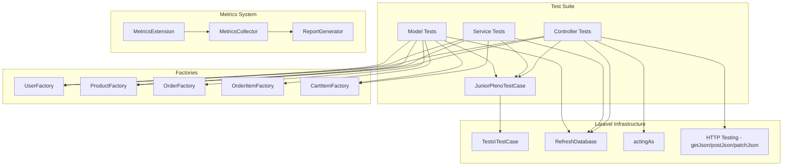
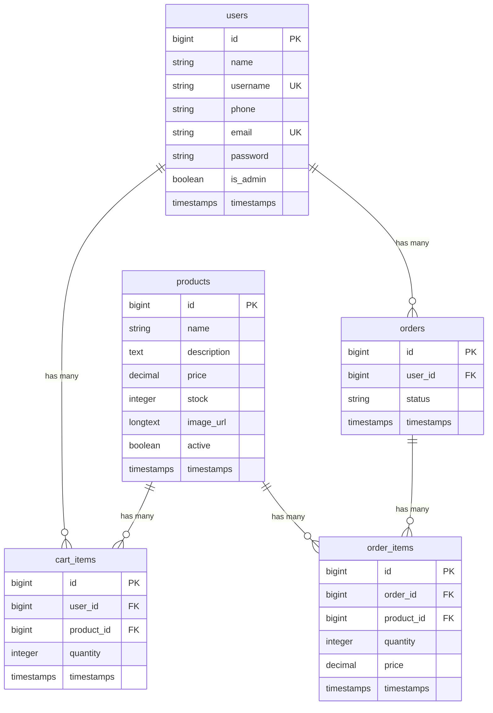

# Design Document: Junior/Pleno Unit Tests

## Overview

Este documento descreve o design técnico para a implementação de uma suíte de testes unitários simulando o trabalho de um desenvolvedor júnior/pleno. A suíte (`Suite_Junior`) cobrirá Controllers, Services e Models do sistema de e-commerce Laravel, com cobertura parcial intencional. Os testes serão organizados em `tests/JuniorPlenoTests/` e integrados ao sistema de métricas existente em `app/Testing/Metrics/`.

O objetivo principal é criar uma baseline realista de testes que possa ser comparada com testes gerados por IA em uma fase posterior. A suíte utiliza PHPUnit (via Laravel TestCase), factories para geração de dados, e é compatível com a `MetricsExtension` já configurada no `phpunit.xml`.

### Decisões de Design

1. **Classe base `JuniorPlenoTestCase`**: Estende `Tests\TestCase` para centralizar setup comum (ex: helper para criar usuário admin). Evita duplicação entre os arquivos de teste.
2. **Factories dedicadas**: Criação de `ProductFactory`, `OrderFactory`, `OrderItemFactory` e `CartItemFactory` no diretório padrão `database/factories/`, reutilizando a `UserFactory` existente.
3. **Testes de Controller como Feature Tests**: Os testes de controller fazem requisições HTTP reais via `$this->postJson()`, `$this->getJson()`, etc., testando o fluxo completo (rota → controller → service → banco). Isso é consistente com o estilo de um dev júnior/pleno que testa "de fora pra dentro".
4. **Testes de Service e Model como Unit Tests**: Instanciam os services diretamente e testam a lógica de negócio com banco de dados em memória (SQLite + `RefreshDatabase`).
5. **Cobertura parcial intencional**: Omissão deliberada de `UserController`, métodos auxiliares do `CartService`, `updateItem`, `update`/`destroy` do `ProductController`, e cenários extremos.

## Architecture

### Diagrama de Estrutura de Arquivos

```
tests/
└── JuniorPlenoTests/
    ├── JuniorPlenoTestCase.php       # Classe base compartilhada
    ├── Controllers/
    │   ├── AuthControllerTest.php    # Login, create-account (happy + error)
    │   ├── ProductControllerTest.php # Listagem, detalhes, 404
    │   ├── CartControllerTest.php    # Adicionar item ao carrinho
    │   └── OrderControllerTest.php   # Criar pedido, update status (admin/non-admin)
    ├── Services/
    │   ├── AuthServiceTest.php       # Login válido/inválido, create
    │   ├── ProductServiceTest.php    # Create (admin/non-admin), list
    │   ├── CartServiceTest.php       # addItem (happy + validações)
    │   └── OrderServiceTest.php      # createFromCart (happy + estoque insuficiente)
    └── Models/
        ├── ProductModelTest.php      # available_stock, reserved_quantity, decreaseStock, scope active
        ├── OrderModelTest.php        # total attribute
        └── UserModelTest.php         # Relacionamentos orders, cartItems
```

### Diagrama de Dependências



### Integração com Métricas

A suíte se integra ao sistema de métricas de forma transparente:

1. O `phpunit.xml` já registra a `MetricsExtension` como extensão bootstrap
2. A extensão registra subscribers que interceptam eventos de início/fim de cada teste
3. Ao adicionar a testsuite "JuniorPleno" no `phpunit.xml`, o comando `php artisan test:metrics --filter=JuniorPleno` executa apenas os testes da suíte e coleta métricas automaticamente
4. Nenhuma configuração adicional é necessária nos arquivos de teste

## Components and Interfaces

### 1. JuniorPlenoTestCase (Classe Base)

```php
namespace Tests\JuniorPlenoTests;

use Tests\TestCase;
use App\Models\User;
use Illuminate\Foundation\Testing\RefreshDatabase;

abstract class JuniorPlenoTestCase extends TestCase
{
    use RefreshDatabase;

    protected function createAdminUser(array $overrides = []): User;
    protected function createRegularUser(array $overrides = []): User;
}
```

**Responsabilidades:**

- Fornecer helpers `createAdminUser()` e `createRegularUser()` para evitar duplicação
- Incluir o trait `RefreshDatabase` para isolamento entre testes
- Servir como ponto de extensão para setup comum futuro

### 2. Service Tests

#### AuthServiceTest

| Método de Teste                                            | Cenário                            | Requisito |
| ---------------------------------------------------------- | ---------------------------------- | --------- |
| `test_login_returns_user_and_token_with_valid_credentials` | Login com credenciais válidas      | 2.1       |
| `test_login_returns_null_with_invalid_email`               | Login com email inexistente        | 2.2       |
| `test_login_returns_null_with_wrong_password`              | Login com senha incorreta          | 2.2       |
| `test_create_returns_user_and_token_and_persists`          | Criação de conta com dados válidos | 2.3       |

#### ProductServiceTest

| Método de Teste                                      | Cenário                       | Requisito |
| ---------------------------------------------------- | ----------------------------- | --------- |
| `test_create_product_with_admin_user`                | Admin cria produto            | 2.4       |
| `test_create_product_without_admin_throws_exception` | Não-admin tenta criar produto | 2.5       |
| `test_list_returns_only_active_products`             | Listagem filtra inativos      | 2.6       |

#### CartServiceTest

| Método de Teste                                       | Cenário                   | Requisito |
| ----------------------------------------------------- | ------------------------- | --------- |
| `test_add_item_creates_cart_item_for_active_product`  | Produto ativo com estoque | 2.7       |
| `test_add_item_throws_exception_for_inactive_product` | Produto inativo           | 2.8       |
| `test_add_item_throws_exception_when_stock_exceeded`  | Estoque insuficiente      | 2.9       |

#### OrderServiceTest

| Método de Teste                                                 | Cenário              | Requisito |
| --------------------------------------------------------------- | -------------------- | --------- |
| `test_create_from_cart_creates_order_with_pending_status`       | Pedido válido        | 2.10      |
| `test_create_from_cart_throws_exception_for_insufficient_stock` | Estoque insuficiente | 2.11      |

### 3. Controller Tests

#### AuthControllerTest

| Método de Teste                                   | Cenário                         | Requisito |
| ------------------------------------------------- | ------------------------------- | --------- |
| `test_login_with_valid_credentials_returns_200`   | POST /api/login válido          | 3.1       |
| `test_login_with_invalid_credentials_returns_401` | POST /api/login inválido        | 3.2       |
| `test_create_account_with_valid_data_returns_201` | POST /api/create-account válido | 3.3       |

#### ProductControllerTest

| Método de Teste                                 | Cenário                            | Requisito |
| ----------------------------------------------- | ---------------------------------- | --------- |
| `test_index_returns_200_with_active_products`   | GET /api/products                  | 3.4       |
| `test_show_returns_200_for_existing_product`    | GET /api/products/{id} existente   | 3.5       |
| `test_show_returns_404_for_nonexistent_product` | GET /api/products/{id} inexistente | 3.6       |

#### CartControllerTest

| Método de Teste                                 | Cenário                    | Requisito |
| ----------------------------------------------- | -------------------------- | --------- |
| `test_store_returns_200_for_authenticated_user` | POST /api/cart autenticado | 3.7       |

#### OrderControllerTest

| Método de Teste                                | Cenário                                       | Requisito |
| ---------------------------------------------- | --------------------------------------------- | --------- |
| `test_store_returns_201_for_valid_order`       | POST /api/orders                              | 3.8       |
| `test_update_status_returns_200_for_admin`     | PATCH /api/admin/orders/{id}/status admin     | 3.9       |
| `test_update_status_returns_403_for_non_admin` | PATCH /api/admin/orders/{id}/status não-admin | 3.10      |

### 4. Model Tests

#### ProductModelTest

| Método de Teste                                     | Cenário                    | Requisito |
| --------------------------------------------------- | -------------------------- | --------- |
| `test_available_stock_returns_stock_minus_reserved` | Atributo available_stock   | 4.1       |
| `test_reserved_quantity_returns_sum_of_cart_items`  | Atributo reserved_quantity | 4.2       |
| `test_decrease_stock_decrements_stock`              | Método decreaseStock       | 4.3       |
| `test_scope_active_returns_only_active_products`    | Scope active               | 4.4       |

#### OrderModelTest

| Método de Teste                                  | Cenário        | Requisito |
| ------------------------------------------------ | -------------- | --------- |
| `test_total_returns_sum_of_price_times_quantity` | Atributo total | 4.5       |

#### UserModelTest

| Método de Teste                         | Cenário                  | Requisito |
| --------------------------------------- | ------------------------ | --------- |
| `test_user_has_orders_relationship`     | Relacionamento orders    | 4.6       |
| `test_user_has_cart_items_relationship` | Relacionamento cartItems | 4.6       |

### 5. Factories

#### ProductFactory

```php
namespace Database\Factories;

class ProductFactory extends Factory
{
    protected $model = Product::class;

    public function definition(): array
    {
        return [
            'name' => fake()->words(3, true),
            'description' => fake()->sentence(),
            'price' => fake()->randomFloat(2, 1.00, 1000.00),
            'stock' => fake()->numberBetween(1, 100),
            'image_url' => fake()->imageUrl(),
            'active' => true,
        ];
    }
}
```

#### OrderFactory

```php
namespace Database\Factories;

class OrderFactory extends Factory
{
    protected $model = Order::class;

    public function definition(): array
    {
        return [
            'user_id' => User::factory(),
            'status' => 'pending',
        ];
    }
}
```

#### OrderItemFactory

```php
namespace Database\Factories;

class OrderItemFactory extends Factory
{
    protected $model = OrderItem::class;

    public function definition(): array
    {
        return [
            'order_id' => Order::factory(),
            'product_id' => Product::factory(),
            'quantity' => fake()->numberBetween(1, 5),
            'price' => fake()->randomFloat(2, 1.00, 1000.00),
        ];
    }
}
```

#### CartItemFactory

```php
namespace Database\Factories;

class CartItemFactory extends Factory
{
    protected $model = CartItem::class;

    public function definition(): array
    {
        return [
            'user_id' => User::factory(),
            'product_id' => Product::factory(),
            'quantity' => fake()->numberBetween(1, 5),
        ];
    }
}
```

## Data Models

### Entidades e Relacionamentos do Banco de Dados



### Atributos Calculados (Accessors)

| Model     | Atributo            | Cálculo                                               |
| --------- | ------------------- | ----------------------------------------------------- |
| `Product` | `available_stock`   | `max(0, stock - reserved_quantity)`                   |
| `Product` | `reserved_quantity` | `SUM(cart_items.quantity) WHERE product_id = this.id` |
| `Order`   | `total`             | `SUM(order_items.price * order_items.quantity)`       |

### Dados de Teste (Factories)

| Factory            | Campos Gerados                                     | Valores                                         |
| ------------------ | -------------------------------------------------- | ----------------------------------------------- |
| `UserFactory`      | name, username, phone, email, password, is_admin   | Faker defaults, is_admin=false                  |
| `ProductFactory`   | name, description, price, stock, image_url, active | price: 1.00-1000.00, stock: 1-100, active: true |
| `OrderFactory`     | user_id, status                                    | User::factory(), status: "pending"              |
| `OrderItemFactory` | order_id, product_id, quantity, price              | Order/Product::factory(), qty: 1-5              |
| `CartItemFactory`  | user_id, product_id, quantity                      | User/Product::factory(), qty: 1-5               |

## Correctness Properties

_A property is a characteristic or behavior that should hold true across all valid executions of a system — essentially, a formal statement about what the system should do. Properties serve as the bridge between human-readable specifications and machine-verifiable correctness guarantees._

### Property 1: Valid login returns user and token

_For any_ user persisted in the database with a known password, calling `AuthService::login` with the correct email and password should return a non-null array containing the keys "user" and "token", where "user" is the same user and "token" is a non-empty string.

**Validates: Requirements 2.1**

### Property 2: Invalid credentials return null

_For any_ email/password combination where either the email does not exist in the database or the password does not match the stored hash, calling `AuthService::login` should return null.

**Validates: Requirements 2.2**

### Property 3: Account creation round trip

_For any_ valid user data (name, username, phone, email, password), calling `AuthService::create` should return an array with "user" and "token" keys, and querying the database by the provided email should find the persisted user with matching name and email.

**Validates: Requirements 2.3**

### Property 4: Admin authorization for product creation

_For any_ valid product data and any user where `is_admin` is false, calling `ProductService::create` with that user as actor should throw `AuthorizationException`. Conversely, for any user where `is_admin` is true, the call should succeed and return a persisted `Product`.

**Validates: Requirements 2.4, 2.5**

### Property 5: Active products filter invariant

_For any_ set of products in the database with varying `active` values, calling `ProductService::list()`, `Product::active()->get()`, or `GET /api/products` should return only products where `active` is true. No inactive product should ever appear in the results.

**Validates: Requirements 2.6, 3.4, 4.4**

### Property 6: Cart item creation with stock validation

_For any_ active product with available stock greater than zero and any authenticated user, calling `CartService::addItem` with a quantity within available stock should create a `CartItem` associated to that user. For any inactive product, the call should throw `ValidationException`. For any quantity exceeding available stock, the call should throw `ValidationException`.

**Validates: Requirements 2.7, 2.8, 2.9**

### Property 7: Order creation with stock decrement

_For any_ set of valid items where each product has sufficient stock, calling `OrderService::createFromCart` should create an `Order` with status "pending", create the corresponding `OrderItem` records, and decrement each product's stock by the ordered quantity. For any item set where at least one product has insufficient stock, the call should throw `ValidationException`.

**Validates: Requirements 2.10, 2.11**

### Property 8: HTTP authentication responses

_For any_ valid user credentials, `POST /api/login` should return status 200 with JSON containing "user" and "token". For any invalid credentials, it should return status 401. For any valid account data, `POST /api/create-account` should return status 201 with JSON containing "user" and "token".

**Validates: Requirements 3.1, 3.2, 3.3**

### Property 9: Product endpoint responses

_For any_ existing product ID, `GET /api/products/{id}` should return status 200 with the product data. For any non-existent product ID, it should return status 404.

**Validates: Requirements 3.5, 3.6**

### Property 10: Cart and order endpoint responses

_For any_ authenticated user with valid cart data (active product, sufficient stock), `POST /api/cart` should return status 200 with the added item. For any authenticated user with valid order items, `POST /api/orders` should return status 201 with the created order.

**Validates: Requirements 3.7, 3.8**

### Property 11: Admin authorization at HTTP level

_For any_ admin user and existing order, `PATCH /api/admin/orders/{id}/status` with a valid status should return 200 with the updated order. For any non-admin user, the same request should return 403.

**Validates: Requirements 3.9, 3.10**

### Property 12: Product stock computation invariant

_For any_ product with any number of associated `CartItem` records, the `reserved_quantity` attribute should equal the sum of all cart item quantities for that product, and the `available_stock` attribute should equal `max(0, stock - reserved_quantity)`. After calling `decreaseStock(n)`, the product's stock should be decremented by exactly `n`.

**Validates: Requirements 4.1, 4.2, 4.3**

### Property 13: Order total computation

_For any_ order with any number of associated `OrderItem` records, the `total` attribute should equal the sum of `(price × quantity)` for each order item.

**Validates: Requirements 4.5**

### Property 14: User model relationships

_For any_ user with associated orders and cart items, `user->orders` should return all orders belonging to that user, and `user->cartItems` should return all cart items belonging to that user.

**Validates: Requirements 4.6**

### Property 15: Factory data generation within constraints

_For any_ instance generated by `ProductFactory`, the price should be between 1.00 and 1000.00, stock between 1 and 100, and active should default to true. For any `OrderFactory` instance, status should default to "pending". For any `OrderItemFactory` instance, quantity should be between 1 and 5. For any `CartItemFactory` instance, quantity should be between 1 and 5.

**Validates: Requirements 8.1, 8.2, 8.3, 8.4**

## Error Handling

### Estratégia de Tratamento de Erros nos Testes

| Cenário                                 | Exceção Esperada             | Teste                                             | Requisito |
| --------------------------------------- | ---------------------------- | ------------------------------------------------- | --------- |
| Não-admin cria produto                  | `AuthorizationException`     | `ProductServiceTest`, `expectException()`         | 2.5       |
| addItem com produto inativo             | `ValidationException`        | `CartServiceTest`, `expectException()` + mensagem | 2.8       |
| addItem com estoque insuficiente        | `ValidationException`        | `CartServiceTest`, `expectException()` + mensagem | 2.9       |
| createFromCart com estoque insuficiente | `ValidationException`        | `OrderServiceTest`, `expectException()`           | 2.11      |
| Login com credenciais inválidas         | Retorno `null` (sem exceção) | `AuthServiceTest`, `assertNull()`                 | 2.2       |
| Produto não encontrado (HTTP)           | Status 404                   | `ProductControllerTest`, `assertStatus(404)`      | 3.6       |
| Não-admin atualiza status (HTTP)        | Status 403                   | `OrderControllerTest`, `assertStatus(403)`        | 3.10      |

### Padrão de Teste para Exceções

Os testes de exceção seguem o padrão:

```php
// Arrange
$product = Product::factory()->create(['active' => false]);
$user = User::factory()->create();

// Act & Assert
$this->expectException(ValidationException::class);
$this->cartService->addItem($user, $product->id, 1);
```

Para testes HTTP, as exceções são verificadas via status code:

```php
$response = $this->postJson('/api/cart', ['product_id' => $product->id, 'quantity' => 1]);
$response->assertStatus(422);
```

## Testing Strategy

### Abordagem Dual: Testes Unitários + Testes Property-Based

A suíte utiliza duas abordagens complementares:

1. **Testes unitários (PHPUnit)**: Verificam exemplos específicos, edge cases e condições de erro. São os testes principais desta suíte, escritos no estilo júnior/pleno.
2. **Testes property-based (PHPUnit + `phpunit/phpunit` com data providers)**: Verificam propriedades universais com múltiplas entradas geradas. Utilizam a biblioteca **`spatie/phpunit-snapshot-assertions`** não é necessária; em vez disso, usamos **data providers nativos do PHPUnit** combinados com **Faker** para gerar múltiplas entradas aleatórias, simulando property-based testing dentro do ecossistema PHPUnit/Laravel.

### Biblioteca de Property-Based Testing

Para PHP/Laravel, a abordagem recomendada é usar **`innmind/black-box`** como biblioteca de property-based testing, que oferece:

- Geração aleatória de dados com shrinking
- Integração com PHPUnit
- API fluente para definir propriedades

Alternativamente, para manter simplicidade (estilo júnior/pleno), os testes property-based podem ser implementados com **data providers do PHPUnit + Faker** gerando 100+ iterações por propriedade.

### Configuração de Property-Based Tests

- Cada property test deve executar no mínimo **100 iterações**
- Cada property test deve referenciar a propriedade do design document via comentário:
    ```php
    // Feature: junior-unit-tests, Property 12: Product stock computation invariant
    ```
- Tag format: `Feature: junior-unit-tests, Property {number}: {property_text}`
- Cada correctness property DEVE ser implementada por um ÚNICO property-based test

### Organização dos Testes

| Tipo             | Diretório                             | Quantidade Estimada | Foco                        |
| ---------------- | ------------------------------------- | ------------------- | --------------------------- |
| Service Tests    | `tests/JuniorPlenoTests/Services/`    | ~11 métodos         | Lógica de negócio           |
| Controller Tests | `tests/JuniorPlenoTests/Controllers/` | ~10 métodos         | Fluxos HTTP                 |
| Model Tests      | `tests/JuniorPlenoTests/Models/`      | ~7 métodos          | Atributos e relacionamentos |
| **Total**        |                                       | **~28 métodos**     |                             |

### Cobertura Intencional vs. Omissões

**Coberto:**

- Happy paths de todos os Services (Auth, Product, Cart, Order)
- Principais fluxos de erro (credenciais inválidas, autorização, validação de estoque)
- Endpoints HTTP mais utilizados
- Atributos calculados dos Models (available_stock, reserved_quantity, total)
- Relacionamentos do User Model

**Omitido intencionalmente (Requisito 5):**

- `UserController` (lógica mínima)
- `CartService::clear`, `CartService::getItems`, `CartService::availableStockForUser`
- `CartService::updateItem`
- `ProductController::update`, `ProductController::destroy`
- Cenários extremos (caracteres especiais, limites de inteiros, payloads malformados)

### Integração com Sistema de Métricas

- Os testes são executados via `php artisan test:metrics --filter=JuniorPleno`
- A `MetricsExtension` no `phpunit.xml` coleta métricas automaticamente
- Flag `--coverage` habilita coleta de cobertura de código
- Flag `--json` exporta métricas em JSON para análise comparativa
- Nenhuma configuração adicional é necessária nos arquivos de teste
- A testsuite "JuniorPleno" deve ser adicionada ao `phpunit.xml`:

```xml
<testsuite name="JuniorPleno">
    <directory>tests/JuniorPlenoTests</directory>
</testsuite>
```
