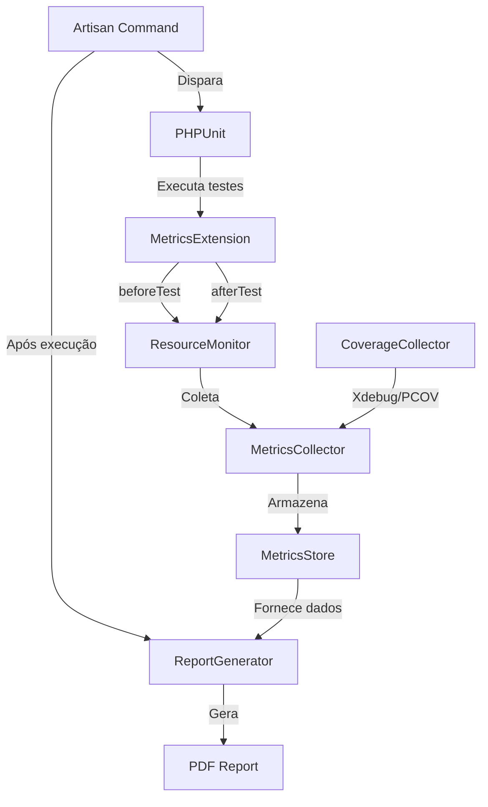

# Design: Métricas de Testes Unitários Laravel

## Visão Geral

Esta feature implementa um sistema de coleta de métricas de testes unitários em um projeto Laravel 12, sem modificar os testes existentes. O sistema utiliza uma extensão PHPUnit para capturar automaticamente métricas de desempenho (tempo de execução, uso de CPU e memória) e cobertura de código (via Xdebug ou PCOV) durante a execução dos testes. Após a coleta, os dados são estruturados em formato tabular e exportados como relatório PDF. Os dados coletados serão posteriormente utilizados para análise estatística com o teste de Wilcoxon.

### Decisões de Design

- **PHPUnit Extension**: Utilizar a API de eventos do PHPUnit 11+ (`Extension`, `Subscriber`) para interceptar a execução dos testes sem modificá-los. Isso garante zero impacto no código de teste existente.
- **Coleta de Recursos**: Usar `getrusage()` para CPU e `memory_get_peak_usage()` para memória, pois são funções nativas do PHP sem dependências externas.
- **Cobertura de Código**: Suportar tanto Xdebug quanto PCOV, detectando automaticamente qual driver está disponível. PCOV é preferido por ter menor overhead.
- **PDF**: Utilizar a biblioteca `barryvdh/laravel-dompdf` por ser a mais integrada ao ecossistema Laravel.
- **Formato de Dados**: Estruturar os dados em formato que facilite a aplicação do teste de Wilcoxon (amostras pareadas por teste).

## Arquitetura



### Fluxo de Execução

1. O usuário executa o comando Artisan `php artisan test:metrics`
2. O comando configura a extensão PHPUnit e inicia a execução dos testes
3. Antes de cada teste, `MetricsExtension` registra o estado inicial (tempo, CPU, memória)
4. Após cada teste, captura o estado final e calcula os deltas
5. `CoverageCollector` coleta dados de cobertura de código por teste
6. Ao final de todos os testes, `ReportGenerator` compila os dados e gera o PDF

## Componentes e Interfaces

### 1. MetricsExtension (PHPUnit Extension)

```php
namespace App\Testing\Metrics;

use PHPUnit\Runner\Extension\Extension;
use PHPUnit\Runner\Extension\Facade;
use PHPUnit\Runner\Extension\ParameterCollection;
use PHPUnit\TextUI\Configuration\Configuration;

class MetricsExtension implements Extension
{
    public function bootstrap(
        Configuration $configuration,
        Facade $facade,
        ParameterCollection $parameters
    ): void;
}
```

### 2. MetricsSubscriber (Event Subscribers)

```php
namespace App\Testing\Metrics;

class TestPreparedSubscriber implements \PHPUnit\Event\Test\PreparedSubscriber
{
    public function notify(\PHPUnit\Event\Test\Prepared $event): void;
}

class TestFinishedSubscriber implements \PHPUnit\Event\Test\FinishedSubscriber
{
    public function notify(\PHPUnit\Event\Test\Finished $event): void;
}
```

### 3. ResourceMonitor

```php
namespace App\Testing\Metrics;

class ResourceMonitor
{
    public function snapshot(): ResourceSnapshot;
    public function diff(ResourceSnapshot $before, ResourceSnapshot $after): ResourceDiff;
}

class ResourceSnapshot
{
    public readonly float $wallTime;
    public readonly float $userCpuTime;
    public readonly float $systemCpuTime;
    public readonly int $peakMemoryBytes;
}

class ResourceDiff
{
    public readonly float $wallTimeDelta;
    public readonly float $userCpuTimeDelta;
    public readonly float $systemCpuTimeDelta;
    public readonly int $peakMemoryDelta;
}
```

### 4. CoverageCollector

```php
namespace App\Testing\Metrics;

class CoverageCollector
{
    public function __construct(?string $driver = null);
    public function isAvailable(): bool;
    public function getDriver(): string; // 'xdebug', 'pcov', ou 'none'
    public function startCoverage(string $testName): void;
    public function stopCoverage(): CoverageResult;
}

class CoverageResult
{
    public readonly string $testName;
    public readonly int $linesExecuted;
    public readonly int $linesTotal;
    public readonly float $coveragePercentage;
    /** @var array<string, array<int, int>> */
    public readonly array $filesCovered;
}
```

### 5. MetricsCollector

```php
namespace App\Testing\Metrics;

class MetricsCollector
{
    public function recordTestStart(string $testName): void;
    public function recordTestEnd(string $testName, string $status): void;
    public function getResults(): MetricsResultCollection;
}
```

### 6. MetricsStore

```php
namespace App\Testing\Metrics;

class MetricsStore
{
    /** @var array<string, TestMetric> */
    private array $metrics = [];

    public function add(TestMetric $metric): void;
    public function all(): array;
    public function toArray(): array;
    public function toJson(): string;
    public static function fromJson(string $json): self;
}
```

### 7. ReportGenerator

```php
namespace App\Testing\Metrics;

class ReportGenerator
{
    public function __construct(MetricsStore $store);
    public function generatePdf(string $outputPath): string;
    public function generateHtml(): string;
    public function generateArray(): array;
}
```

### 8. Artisan Command

```php
namespace App\Console\Commands;

use Illuminate\Console\Command;

class TestMetricsCommand extends Command
{
    protected $signature = 'test:metrics
        {--filter= : Filtro de testes PHPUnit}
        {--coverage : Habilitar coleta de cobertura de código}
        {--output= : Caminho do arquivo PDF de saída}
        {--json : Exportar também em formato JSON}';

    protected $description = 'Executa testes unitários e coleta métricas de desempenho';

    public function handle(): int;
}
```

## Modelos de Dados

### TestMetric

```php
namespace App\Testing\Metrics;

class TestMetric
{
    public function __construct(
        public readonly string $testClass,
        public readonly string $testMethod,
        public readonly string $testName,       // "Class::method"
        public readonly string $status,          // 'passed', 'failed', 'skipped', 'error'
        public readonly float $wallTime,         // segundos
        public readonly float $userCpuTime,      // segundos
        public readonly float $systemCpuTime,    // segundos
        public readonly int $peakMemoryBytes,    // bytes
        public readonly ?float $coveragePercent, // 0.0 - 100.0 ou null
        public readonly ?int $linesExecuted,
        public readonly ?int $linesTotal,
        public readonly \DateTimeImmutable $executedAt,
    ) {}

    public function toArray(): array;
}
```

### MetricsResultCollection

```php
namespace App\Testing\Metrics;

class MetricsResultCollection
{
    /** @var TestMetric[] */
    private array $metrics;

    public function count(): int;
    public function totalWallTime(): float;
    public function averageWallTime(): float;
    public function totalMemoryPeak(): int;
    public function averageCoverage(): ?float;
    public function groupByClass(): array;
    public function sortByWallTime(string $direction = 'desc'): self;
    public function toArray(): array;
}
```

### Estrutura do Relatório PDF

O relatório PDF conterá as seguintes seções:

1. **Cabeçalho**: Nome do projeto, data/hora da execução, versão do PHP e driver de cobertura
2. **Resumo**: Total de testes, tempo total, memória pico, cobertura média
3. **Tabela de Métricas por Teste**:

| Teste         | Status | Tempo (ms) | CPU User (ms) | CPU Sys (ms) | Memória (KB) | Cobertura (%) |
| ------------- | ------ | ---------- | ------------- | ------------ | ------------ | ------------- |
| Class::method | ✓      | 12.5       | 10.2          | 1.3          | 2048         | 85.2          |

4. **Tabela Resumo por Classe**: Agregação das métricas por classe de teste
5. **Dados para Wilcoxon**: Seção com dados estruturados para análise estatística pareada

### Formato JSON (para análise Wilcoxon)

```json
{
    "metadata": {
        "project": "backend-laravel",
        "executed_at": "2024-01-15T10:30:00Z",
        "php_version": "8.3.0",
        "coverage_driver": "pcov",
        "total_tests": 42
    },
    "metrics": [
        {
            "test_class": "Tests\\Unit\\ExampleTest",
            "test_method": "testBasicExample",
            "test_name": "Tests\\Unit\\ExampleTest::testBasicExample",
            "status": "passed",
            "wall_time_ms": 12.5,
            "user_cpu_time_ms": 10.2,
            "system_cpu_time_ms": 1.3,
            "peak_memory_kb": 2048,
            "coverage_percent": 85.2,
            "lines_executed": 17,
            "lines_total": 20,
            "executed_at": "2024-01-15T10:30:01Z"
        }
    ],
    "summary": {
        "total_wall_time_ms": 525.0,
        "average_wall_time_ms": 12.5,
        "total_peak_memory_kb": 86016,
        "average_coverage_percent": 78.5
    }
}
```

## Propriedades de Corretude

_Uma propriedade é uma característica ou comportamento que deve ser verdadeiro em todas as execuções válidas de um sistema — essencialmente, uma declaração formal sobre o que o sistema deve fazer. Propriedades servem como ponte entre especificações legíveis por humanos e garantias de corretude verificáveis por máquina._

### Propriedade 1: Invariantes de métricas válidas

_Para qualquer_ TestMetric coletado, wallTime deve ser >= 0, userCpuTime deve ser >= 0, systemCpuTime deve ser >= 0, peakMemoryBytes deve ser > 0, status deve ser um dos valores válidos ('passed', 'failed', 'skipped', 'error'), e toArray() deve retornar um array contendo todas as chaves obrigatórias (test_class, test_method, test_name, status, wall_time, user_cpu_time, system_cpu_time, peak_memory_bytes, executed_at).

**Validates: Requirements 1.2, 1.3, 1.4, 4.1, 4.2**

### Propriedade 2: Transparência da extensão

_Para qualquer_ teste PHPUnit executado com a MetricsExtension ativa, o resultado do teste (passed/failed/skipped) deve ser idêntico ao resultado sem a extensão. A extensão não deve alterar o comportamento dos testes.

**Validates: Requirements 1.1**

### Propriedade 3: Invariante de cobertura de código

_Para qualquer_ TestMetric com cobertura habilitada, linesExecuted deve ser <= linesTotal, linesTotal deve ser > 0, e coveragePercent deve ser igual a (linesExecuted / linesTotal) \* 100, com tolerância de 0.01.

**Validates: Requirements 1.5**

### Propriedade 4: Domínio do driver de cobertura

_Para qualquer_ ambiente de execução, CoverageCollector::getDriver() deve retornar exatamente um dos valores: 'xdebug', 'pcov', ou 'none'. Quando isAvailable() retorna true, getDriver() não deve retornar 'none'.

**Validates: Requirements 1.6**

### Propriedade 5: Round-trip de serialização JSON

_Para qualquer_ MetricsStore contendo uma coleção de TestMetrics, serializar via toJson() e depois deserializar via fromJson() deve produzir dados equivalentes aos originais. O JSON produzido deve ser válido e conter as seções 'metadata', 'metrics' e 'summary'.

**Validates: Requirements 2.3, 4.4**

### Propriedade 6: Conteúdo do relatório

_Para qualquer_ conjunto não-vazio de TestMetrics, o HTML intermediário gerado pelo ReportGenerator deve conter: o nome de cada teste presente na coleção, os valores de tempo e memória de cada teste, e as seções de cabeçalho, resumo e tabela.

**Validates: Requirements 2.2**

### Propriedade 7: Corretude da agregação matemática

_Para qualquer_ MetricsResultCollection com N métricas (N > 0), totalWallTime() deve ser igual à soma de todos os wallTime individuais, averageWallTime() deve ser igual a totalWallTime() / N, e count() deve ser igual a N.

**Validates: Requirements 4.3**

### Propriedade 8: Corretude do diff de recursos

_Para quaisquer_ dois ResourceSnapshots (before, after), ResourceMonitor::diff() deve produzir um ResourceDiff onde wallTimeDelta == after.wallTime - before.wallTime, userCpuTimeDelta == after.userCpuTime - before.userCpuTime, e systemCpuTimeDelta == after.systemCpuTime - before.systemCpuTime.

**Validates: Requirements 4.5**

### Propriedade 9: Unicidade de identificadores para pareamento Wilcoxon

_Para qualquer_ MetricsResultCollection, todos os valores de testName devem ser únicos dentro da coleção, garantindo que os dados possam ser pareados corretamente entre execuções para o teste de Wilcoxon.

**Validates: Requirements 2.4**

## Tratamento de Erros

| Cenário                               | Comportamento                                                                                                                                               |
| ------------------------------------- | ----------------------------------------------------------------------------------------------------------------------------------------------------------- |
| Nenhum driver de cobertura disponível | `CoverageCollector` retorna `isAvailable() = false`, métricas de cobertura ficam como `null` no TestMetric. O relatório é gerado sem a coluna de cobertura. |
| Falha na geração do PDF               | `ReportGenerator` lança `ReportGenerationException` com mensagem descritiva. O comando Artisan exibe o erro e retorna código de saída 1.                    |
| Teste com erro/exceção                | A extensão captura as métricas até o ponto da falha e registra status como 'error'. A coleta continua para os próximos testes.                              |
| Diretório de saída inexistente        | O comando Artisan cria o diretório recursivamente antes de salvar o PDF. Se não for possível, exibe erro.                                                   |
| `getrusage()` não disponível          | `ResourceMonitor` usa fallback com `microtime(true)` para wall time e registra CPU como 0. Emite warning no console.                                        |
| JSON inválido na deserialização       | `MetricsStore::fromJson()` lança `InvalidMetricsDataException` com detalhes do erro de parsing.                                                             |
| Coleção vazia de métricas             | `ReportGenerator` gera PDF com mensagem "Nenhum teste executado" em vez de tabela vazia. Métodos de agregação retornam 0.                                   |

## Estratégia de Testes

### Abordagem Dual: Testes Unitários + Testes Baseados em Propriedades

A estratégia de testes combina testes unitários tradicionais com testes baseados em propriedades (property-based testing) para cobertura abrangente.

### Biblioteca de Property-Based Testing

Utilizar **`innmind/black-box`** como biblioteca de property-based testing para PHP. É a opção mais madura para PBT no ecossistema PHP.

Alternativa: caso `innmind/black-box` não esteja disponível, utilizar geradores customizados com loops de 100+ iterações e dados aleatórios via `Faker`.

### Testes Unitários

Focam em exemplos específicos, edge cases e integração:

- **ResourceMonitor**: Testar que `snapshot()` retorna valores válidos em um ambiente real
- **CoverageCollector**: Testar detecção de driver no ambiente atual
- **TestMetricsCommand**: Testar execução do comando com diferentes opções (`--filter`, `--output`, `--json`, `--coverage`)
- **ReportGenerator**: Testar geração de PDF com conjunto fixo de métricas e verificar que o arquivo é criado
- **Edge cases**: Coleção vazia de métricas, teste com nome muito longo, caracteres especiais em nomes de teste

### Testes Baseados em Propriedades

Cada propriedade de corretude do design deve ser implementada como um único teste baseado em propriedades com mínimo de 100 iterações. Cada teste deve ser anotado com um comentário referenciando a propriedade do design.

Formato da tag: `Feature: laravel-unit-testing-metrics, Property {número}: {título}`

```php
// Feature: laravel-unit-testing-metrics, Property 1: Invariantes de métricas válidas
public function testMetricInvariantsProperty(): void
{
    // Gerar 100+ TestMetrics aleatórios e verificar invariantes
}
```

### Mapeamento Propriedade → Teste

| Propriedade                      | Método de Teste                       | Tipo              |
| -------------------------------- | ------------------------------------- | ----------------- |
| P1: Invariantes de métricas      | `testMetricInvariantsProperty`        | Property          |
| P2: Transparência da extensão    | `testExtensionTransparency`           | Unit (integração) |
| P3: Invariante de cobertura      | `testCoverageInvariantProperty`       | Property          |
| P4: Domínio do driver            | `testDriverDomainProperty`            | Property          |
| P5: Round-trip JSON              | `testJsonRoundTripProperty`           | Property          |
| P6: Conteúdo do relatório        | `testReportContentProperty`           | Property          |
| P7: Agregação matemática         | `testAggregationCorrectnessProperty`  | Property          |
| P8: Diff de recursos             | `testResourceDiffCorrectnessProperty` | Property          |
| P9: Unicidade de identificadores | `testUniqueIdentifiersProperty`       | Property          |
